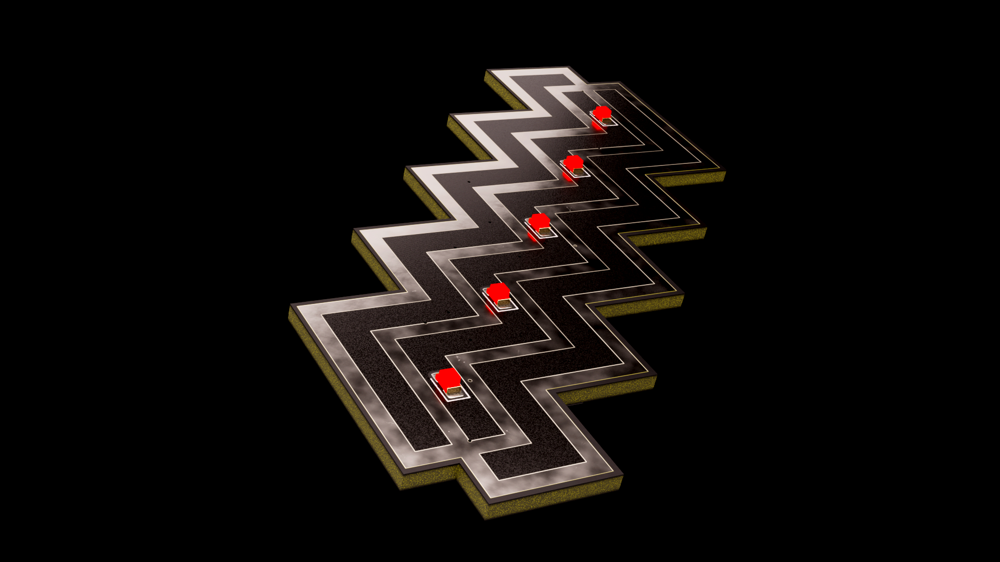

# RadionaOrg ZigZag badge for BSidesZG

### Badge Power ON

Put battery and you will see one LED slightly ON.

There is 5 second programming delay, please wait 5 seconds and badge will start doing LED RAIDER.

### Badge sleep

Hold button until you see all leds on, release button and badge will go to sleep.

In sleep mode badge will consume around 1mA.

To go out of sleep just press button again.

If you will not use badge for long period it is best to remove battery.

### Modes

This badge has 10 cases, 5 are morse code 5 are Pov ( Persistance of Vision ).

On button press you are moving to next case.

### Morse 

It is hardly human readable, so you will need to use some app, or write your own...

Each LED has it's own message, first 4 are encoded clues or keys for last one.

Fourth message is not the same for public and spaekers so make sure you have both.

Last message is encrypted.

Who gets all 5 messages gets the prize!!!

### PoV

GOTO 2DARK

SET BLEND 2S

MOVE BADGE

1,2,3 PoV messages are solutions to first 3 tasks
4,5 PoV messages are clues for messages 4 and 5 if you are stucked...

## Thank you!

Thank's for playing! We hope you like it!

## Licensee
* Hardware is released under CERN Open Hardware Licence Version 2 - Strongly Reciprocal
* Software is released under GPL V3 Licensee
* Documentation is released under CC BY-SA 4.0

Top side PCB design by Damir Prizmić
Back side PCB design by Goran Mahovlić

Idea: BSidesZG, Ante Jurjević, Damir Prizmić, Goran Mahovlić, kost, 1g0r, BalCCon Badge, Olimex RVPC

Code:  Goran Mahovlić 

Big thanks to Olimex for all RVPC code examples...

Known problems (HW): Battery holder footprint is not good, if you push battery to end position it can brick battery

Known problems (SW): In one key you will nottice missing H letter (gramar) - use your key as is ignore gramar.

| Event  | No. of badges | Offered Solutions | Accepted solutions |
| ------ | ------------- | ----------------- | ------------------ |
| BSidesZG | 70 | 1 | 1 |

Badge solvers

BSidesZG - 07.03.2025. - 