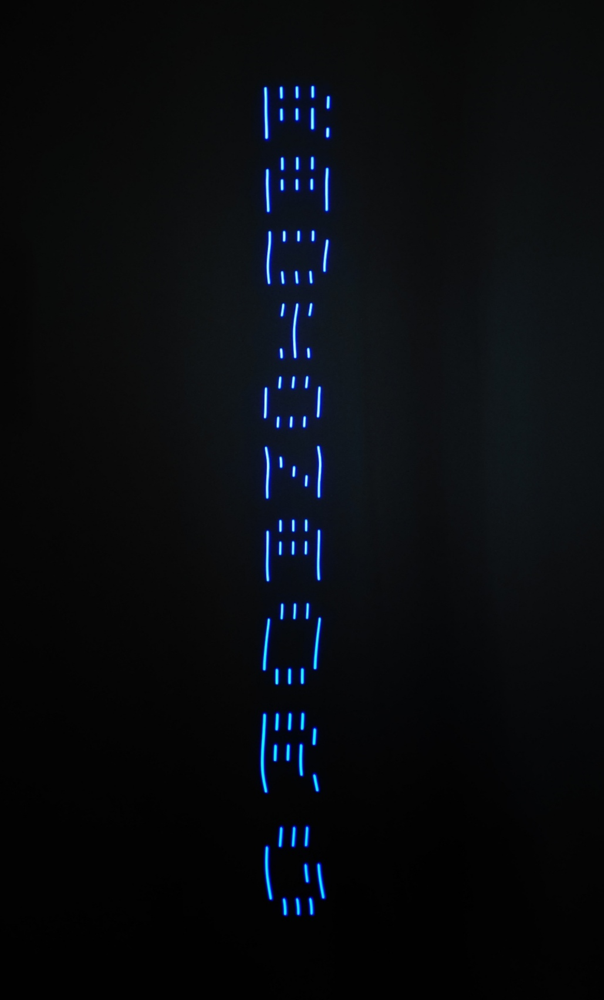
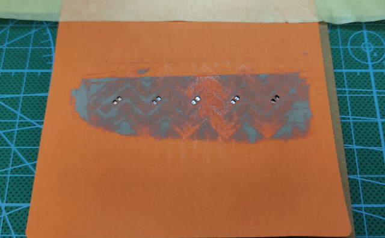
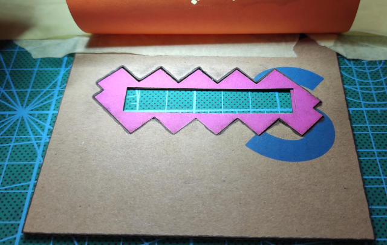
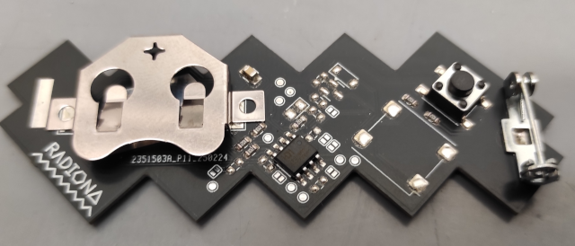
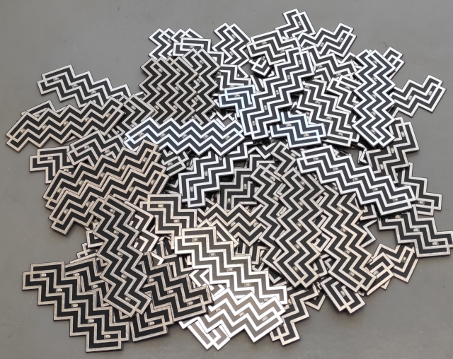
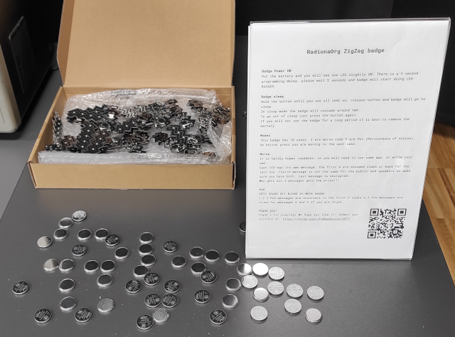
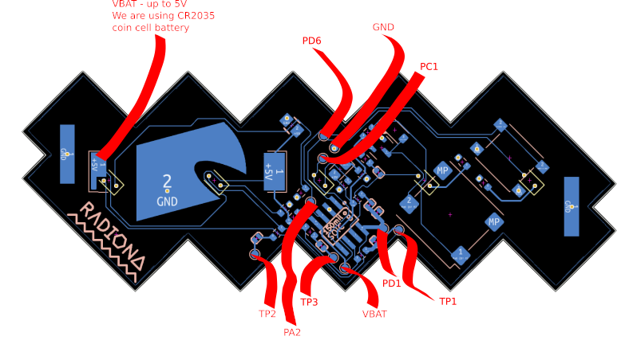

## RadionaOrg ZigZag badge

### Request and starting point

We got request from BSidesZG to design some blink LED badge with some interesting task to solve.

https://www.bsideszagreb.com/

As badge may slightly change over time here is aditional README for BSidesZG

Starting point for our badge was RVPC from Olimex, we have preserved most of schematics, and added LEDs

The EURO 1.00 Risc-V personal computer with VGA and Keyboard and Woz like monitor. The purpose of this project is to make educational platform which people can use to learn RISCV assembler and experiment like in the old days in 1980s :)

https://www.olimex.com/Products/Retro-Computers/RVPC/open-source-hardware

We whare also inspired with BalCCon badge that is using same chip.

https://2k25.balccon.org/

### Few of ideas we wanted to test

- [x] Keep it simple
- [x] Keep it low cost
- [x] Should solderable by hand
- [x] Input and outputs are needed
- [x] Tasks can be quickly changed added
- [x] It needs to be cheap to order assembled
- [x] Use most standard COIN CELL battery CR2032
- [x] Unique design that is connected to Radiona (ZigZag)
- [x] Badge should not draing to much current so it can survive conference day

### Why 5 LEDs?

With less then 5 LEDs we could do blinky, but with 5 we can do PoV

As we have BLUE and RED team, we have tested BLUE and RED LEDs.

RED LED are consuming less, and morse is better readable.

### Why Only one button?

We only have 6 pins, and we did not want to intraduce any aditinal chip.

And there are many things we can do with one button.

Considerring that we can have short press, long press, longer press, double press, tripple press - you get the point that one button should be enough for everything...

### Why those component and why 0603

We are using 0603 resistors and 0805 LEDs as they are still hand solderable, and we are using those on ULX3S so we can recycle components from scraped boards...

### Assembly

We wanted to confirm hand assembly, and low batch DIY assembly so we did first badge by hand, and rest of 69 badges with stencil. 
We baked first batch in oven but also checked paper stancil + hot air, and all works fine.

Paper is just 80g color paper. Diode laser cuts some colors better so we are using orange one.

For PCB holder we are using cuted cardboard

And for BOTTOM side we are using standoff cutter from hammer paper.

Applying paste to front side

### Implemented features

- [x] Fancy raider blinking
- [x] Morse used for output messages
- [x] PoV used for clues and solutions
- [x] Short button press
- [x] Long button press
- [ ] Other types of button presses
- [x] Sleep mode
- [ ] Deep sleep mode

### Make it hackable!

We did not want to remove any RVPC component so with moving few resistors and closing jumpers you could even have RVPC with VGA, PS2 and speaker...

### Badge software

https://github.com/RadionaOrg/ZigZag/tree/main/SOFTWARE/PlatformIO/ZigZag

We are using VScode + PlatformIO for building and flash.sh for flashing...

### Programming

We are using raspberry pico and this software for programming https://github.com/aappleby/picorvd 

Be warned not to remove initial 5 sec delay if you want to keep badge programmable with picorvd.

For programming you only need GND and PD6 test point.

### Test points

### Schematic

### Licensee
* Hardware is released under CERN Open Hardware Licence Version 2 - Strongly Reciprocal
* Software is released under GPL V3 Licensee
* Documentation is released under CC BY-SA 4.0

Top side PCB design by Damir Prizmić
Back side PCB design by Goran Mahovlić

Idea: BSidesZG, Ante Jurjević, Damir Prizmić, Goran Mahovlić, kost, 1g0r, BalCCon Badge, Olimex RVPC

Code:  Goran Mahovlić 

Big thanks to Olimex for all RVPC code examples...

### Events

| Event  | No. of badges | Offered Solutions | Accepted solutions |
| ------ | ------------- | ----------------- | ------------------ |
| BSidesZG | 70 | 1 | 1 |

### Badge solvers

| Event  | Date | Name |
| ------ | ------------- | ----------------- |
| BSidesZG | 07.03.2025. | Jurica Radović |